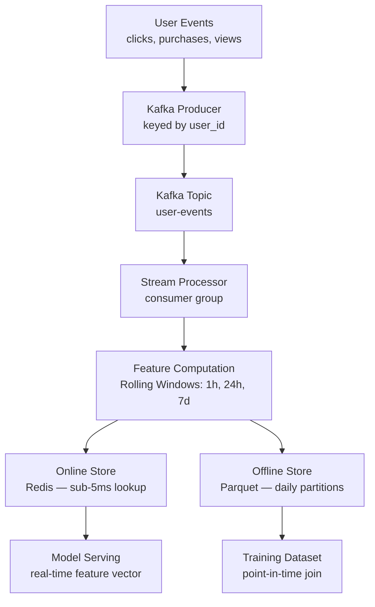
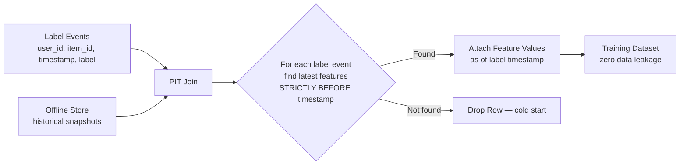

# Real-Time Feature Store with Point-in-Time Training


Event-driven feature computation with point-in-time correct training data generation and online/offline consistency validation. Solves the production ML infrastructure problem that silently breaks more models than any modeling decision: **training-serving skew and label leakage**.

> Point-in-time correctness is what separates feature stores (Feast, Hopsworks, Tecton) from Redis caches. This project implements it directly — the mechanism is transparent, testable, and carries a leakage audit on every training dataset build.

---

## Architecture

### Feature Pipeline



### Point-in-Time Join



---

## Why This Matters

**Label leakage** is invisible until deployment. A purchase on June 1st is labeled as a positive, but `purchase_count_24h` at training time includes activity from June 15th if you join at training time (say, June 30th). Offline metrics look great; production performance is much worse.

**Training-serving skew** is the other side: the feature named `purchase_count_24h` in your training data is computed differently from what the model receives at inference — different windows, different aggregation, different code paths.

FeatureFlow addresses both:
- **Dual-write**: the stream processor writes to Redis and Parquet in the same pass, from the same computation. One codebase, one feature definition.
- **Point-in-time joins**: every training row is joined to features computed strictly before the label event's timestamp.
- **Leakage validation**: `validate_no_leakage()` audits every training dataset before it leaves the builder.
- **Consistency checking**: `ConsistencyChecker` compares online (Redis) and offline (Parquet) values per feature and flags discrepancies above a configurable threshold.

---

## Key Design Decisions

**Why Kafka over Redis Streams or SQS?**
Kafka provides a durable, ordered, replayable log. When you define a new feature, you replay historical events from any offset to backfill it — no re-instrumentation, no waiting for fresh data. Redis Streams and SQS do not support arbitrary-offset historical replay. For feature stores, replay is the mechanism for backfilling new features without gaps.

**Why partition by user_id?**
All events for a given user land on the same partition, in order. The stream processor sees a user's complete event history without cross-partition coordination. Windowed aggregations (`purchases in last 1h`) are correct by construction. Random partitioning would require distributed state or a separate aggregation layer.

**Why dual-write from the same computation?**
Separate codepaths for training vs. serving diverge over time. Schema changes get applied in one place but not the other. The safest guarantee is one computation that writes both. The stream processor is the single source of truth for all feature values.

**Why daily Parquet partitions by entity?**
PIT joins scan features over a date range. Daily partitions (`entity=user/date=2024-01-15/`) mean the join only reads the partitions overlapping with label event timestamps — no full scan. For large corpora this is the difference between seconds and minutes.

---

## Feature Catalog

### User Features

| Feature | Window | Description |
|---|---|---|
| `purchase_count_1h` | 1h | Purchases in last 1 hour |
| `purchase_count_24h` | 24h | Purchases in last 24 hours |
| `item_view_count_1h` | 1h | Item views in last 1 hour |
| `item_view_count_24h` | 24h | Item views in last 24 hours |
| `cart_count_1h` | 1h | Add-to-cart events in last 1 hour |
| `total_spend_24h` | 24h | Total purchase amount in last 24 hours |
| `avg_session_duration` | rolling | Average session duration (minutes) |
| `conversion_rate_7d` | 7d | Purchase / item_view ratio |
| `category_affinity` | 24h | Top 3 categories by view count |
| `days_since_last_purchase` | rolling | Days since most recent purchase |

### Item Features

| Feature | Window | Description |
|---|---|---|
| `view_count_1h` | 1h | Item views in last 1 hour |
| `view_count_24h` | 24h | Item views in last 24 hours |
| `purchase_count_24h` | 24h | Purchases in last 24 hours |
| `cart_add_count_1h` | 1h | Add-to-cart events in last 1 hour |
| `avg_rating` | rolling | Average user rating |
| `conversion_rate_24h` | 24h | Purchase / view ratio |
| `revenue_24h` | 24h | Total revenue in last 24 hours |
| `popularity_rank_1h` | 1h | Relative popularity rank (0–1) |

---

## ML Engineering Features

| Capability | Implementation |
|---|---|
| Point-in-time correctness | `PointInTimeDatasetBuilder` — strict timestamp ordering, no future leakage |
| Dual-write consistency | `StreamProcessor` writes Redis + Parquet in one pass |
| Leakage detection | `validate_no_leakage()` audits every training dataset |
| Training-serving skew | `ConsistencyChecker` — compares Redis vs Parquet per feature |
| Real-time serving | FastAPI + Redis pipeline, target <5ms for `/features/vector` |
| Offline materialization | `BatchProcessor` — hourly Parquet snapshots, backfill support |
| Feature registry | `FeatureRegistry` — single source of truth for metadata and TTLs |
| Observability | Prometheus metrics + Grafana dashboard |

---

## Quickstart

```bash
make install      # install dependencies
make docker-up    # Kafka, Redis, API :8000, Prometheus :9090, Grafana :3000
make produce      # stream 10,000 synthetic events into Kafka
make process      # start stream processor (separate terminal)
```

Build a training dataset offline (no Kafka/Redis needed):
```bash
make build-dataset
# outputs: data/training_dataset.csv
# runs: event generation → hourly snapshots → PIT join → leakage audit
```

---

## Point-in-Time Join

```python
from src.training.dataset_builder import PointInTimeDatasetBuilder

builder = PointInTimeDatasetBuilder(offline_store, registry)
dataset = builder.build(
    label_events=label_df,
    user_features=["purchase_count_24h", "conversion_rate_7d"],
    item_features=["avg_rating", "view_count_24h"],
)
report = builder.validate_no_leakage(dataset, label_df)
assert report.passed
print(report.summary())
# LeakageReport [PASSED] rows_kept=94821 rows_dropped=5179 violations=0
```

---

## Consistency Checker

```python
from src.consistency.checker import ConsistencyChecker

checker = ConsistencyChecker(offline_store, online_store)
report = checker.check(
    entity="user",
    entity_ids=sample_user_ids,
    feature_names=["purchase_count_24h", "total_spend_24h"],
)
print(report.summary())
# ConsistencyReport [PASSED] entity=user checked=500 flagged_features=[]
```

A feature is flagged when > 5% of sampled entities have online/offline values differing by > 5% relative.

---

## API Reference

| Endpoint | Method | Description |
|---|---|---|
| `/features/vector` | POST | Full feature vector for a user — <5ms hot path |
| `/features/user/{id}` | GET | All features for a user entity |
| `/features/item/{id}` | GET | All features for an item entity |
| `/features/batch` | POST | Batch feature lookup |
| `/registry` | GET | Feature catalog with TTLs and metadata |
| `/health` | GET | Service readiness |
| `/metrics` | GET | Prometheus scrape endpoint |

---

## Project Structure

```
featureflow/
├── src/
│   ├── events/
│   │   ├── schema.py           # UserEvent dataclass + Pydantic model
│   │   └── generator.py        # Realistic event stream simulator
│   ├── kafka/
│   │   ├── producer.py         # Keyed by user_id
│   │   └── consumer.py         # Batch consumer with error isolation
│   ├── features/
│   │   ├── definitions.py      # Feature catalog with windows and TTLs
│   │   ├── transformations.py  # Pure, stateless transformation functions
│   │   └── registry.py         # Singleton feature registry
│   ├── stores/
│   │   ├── online_store.py     # Redis — pipelined reads, per-feature TTL
│   │   └── offline_store.py    # Parquet — entity/date partitions
│   ├── pipeline/
│   │   ├── stream_processor.py # Kafka → features → dual-write
│   │   └── batch_processor.py  # Historical backfill, hourly snapshots
│   ├── training/
│   │   └── dataset_builder.py  # PIT join + leakage validation
│   ├── serving/
│   │   ├── app.py              # FastAPI
│   │   └── middleware.py       # Prometheus instrumentation
│   └── consistency/
│       └── checker.py          # Training-serving skew detection
├── scripts/
│   ├── produce_events.py
│   ├── run_processor.py
│   └── build_training_set.py
├── tests/
└── monitoring/
```

---

## Running Tests

```bash
make test
```

Tests are fully self-contained — no Kafka or Redis required. Online store uses an in-memory fallback; offline store writes to `tempfile` directories.

---

## License

MIT
