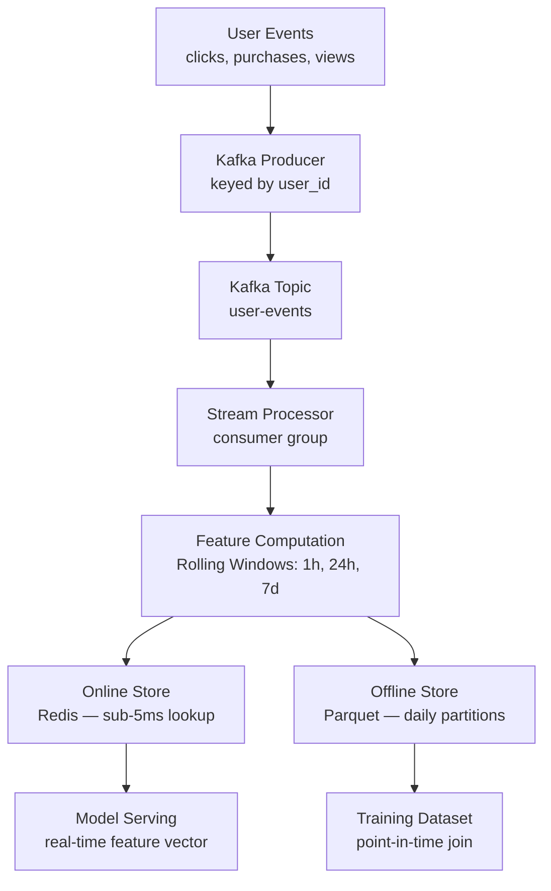
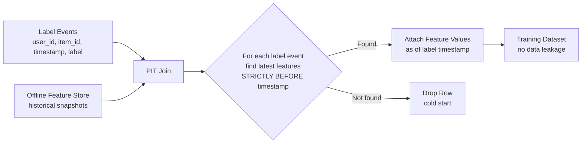

# FeatureFlow


A production-grade ML feature store for real-time e-commerce user behavior features. FeatureFlow demonstrates the infrastructure that separates senior ML engineers from the rest: event-driven feature computation, dual-write online/offline stores, point-in-time correct training data generation, and automated training-serving consistency validation.

---

## Architecture

### Feature Pipeline



### Point-in-Time Join



---

## Key Design Decisions

### Why point-in-time correctness matters

Without it, you have label leakage: training uses features computed from the future relative to the label event. A purchase that happened *after* the model prediction window gets folded into the features used to predict that purchase. Models trained this way produce inflated offline metrics and terrible production performance. This is one of the most common and hardest-to-catch bugs in ML systems — it is invisible until you deploy.

FeatureFlow solves this by storing timestamped feature snapshots to the offline store at regular intervals and joining each training row to the most recent snapshot that predates the label event's timestamp by a strictly-less-than comparison.

### Why separate online and offline stores

The dual-write architecture writes to both Redis (online) and Parquet (offline) from the same computation pass — the same code, the same input events, the same moment in time. This is the only way to guarantee that what the model was trained on matches what it sees at inference. Using different code paths or different data sources for training vs. serving is the root cause of training-serving skew.

### Why Kafka for event ingestion

Kafka provides a durable, ordered, replayable event log. When you define a new feature, you can replay historical events from any offset to backfill it — without re-instrumenting the application or waiting for new data to accumulate. Redis Streams, SQS, or a message queue cannot offer arbitrary-offset replay from months of history.

### Why partition Kafka by user_id

All events for a given user land on the same partition. This means the stream processor sees a user's events in order without any cross-partition coordination or distributed locking. Windowed aggregations (purchases in the last 1h) are correct by construction. If events were distributed randomly across partitions, a single consumer would see a partial view of each user's history.

---

## Feature Catalog

### User Features

| Feature | Window | Type | Description |
|---|---|---|---|
| `purchase_count_1h` | 1h | int | Purchases in last 1 hour |
| `purchase_count_24h` | 24h | int | Purchases in last 24 hours |
| `item_view_count_1h` | 1h | int | Item views in last 1 hour |
| `item_view_count_24h` | 24h | int | Item views in last 24 hours |
| `cart_count_1h` | 1h | int | Add-to-cart events in last 1 hour |
| `total_spend_24h` | 24h | float | Total purchase amount in last 24 hours |
| `avg_session_duration` | all-time | float | Average session duration in minutes |
| `conversion_rate_7d` | 7d | float | Purchase / item_view ratio in last 7 days |
| `category_affinity` | 24h | list | Top 3 item categories by view count |
| `days_since_last_purchase` | all-time | float | Days since most recent purchase |

### Item Features

| Feature | Window | Type | Description |
|---|---|---|---|
| `view_count_1h` | 1h | int | Item views in last 1 hour |
| `view_count_24h` | 24h | int | Item views in last 24 hours |
| `purchase_count_24h` | 24h | int | Purchases in last 24 hours |
| `cart_add_count_1h` | 1h | int | Add-to-cart events in last 1 hour |
| `avg_rating` | all-time | float | Average user rating |
| `conversion_rate_24h` | 24h | float | Purchase / view ratio in last 24 hours |
| `revenue_24h` | 24h | float | Total revenue in last 24 hours |
| `popularity_rank_1h` | 1h | float | Relative popularity rank (0–1) |

---

## ML Engineering Features

| Capability | Implementation |
|---|---|
| Point-in-time correctness | `PointInTimeDatasetBuilder` — as-of joins with strict timestamp ordering |
| Dual-write consistency | `StreamProcessor` writes online + offline from the same computation |
| Leakage detection | `validate_no_leakage` in `dataset_builder.py` |
| Training-serving skew | `ConsistencyChecker` — compares Redis vs Parquet values |
| Real-time serving | FastAPI + Redis pipeline, target <5ms for `/features/vector` |
| Offline materialisation | `BatchProcessor` — hourly Parquet snapshots, backfill support |
| Feature registry | `FeatureRegistry` — single source of truth for feature metadata |
| Observability | Prometheus metrics + Grafana dashboard |

---

## Quickstart

```bash
# 1. Install dependencies
make install

# 2. Start Kafka, Redis, API, Prometheus, Grafana
make docker-up

# 3. Produce 10,000 synthetic events to Kafka
make produce

# 4. Run the stream processor (in a separate terminal)
make process
```

Then explore:
- Feature serving API: http://localhost:8000/docs
- Prometheus metrics: http://localhost:9090
- Grafana dashboard: http://localhost:3000 (admin / featureflow)

### Build a training dataset without Kafka/Redis

```bash
make build-dataset
# Outputs: data/training_dataset.csv
```

This runs entirely offline: generates events, materialises hourly snapshots to Parquet, runs the point-in-time join, and validates no leakage.

---

## Point-in-Time Join

The `PointInTimeDatasetBuilder` is the most critical component for ML correctness.

**The problem:** You have 100,000 label events (purchases, ratings) spread over 30 days. You want to attach each entity's features to each label row. The naive approach is to join on `user_id` and attach the *current* feature values. This creates leakage: a user's feature for "total spend in last 24h" on June 1st will include purchases from June 15th if you join at training time (say, June 30th).

**The solution:** For each label event at time T:
1. Read all feature snapshots for that entity from the offline store.
2. Filter to snapshots where `snapshot_timestamp < T` (strictly before).
3. Take the most recent surviving snapshot.
4. Attach those feature values.

This is what Feast, Hopsworks, and Tecton do internally. FeatureFlow implements it directly so the mechanism is transparent.

```python
builder = PointInTimeDatasetBuilder(offline_store, registry)
dataset = builder.build(
    label_events=label_df,           # user_id, item_id, timestamp, label
    user_features=["purchase_count_24h", "conversion_rate_7d"],
    item_features=["avg_rating", "view_count_24h"],
)
report = builder.validate_no_leakage(dataset, label_df)
assert report.passed  # "PASSED" means zero leakage violations
```

Rows with no feature history before the label timestamp are dropped (cold start). The `LeakageReport` tells you exactly how many rows were kept and whether any violations were detected.

---

## Consistency Checker

The `ConsistencyChecker` detects training-serving skew — the case where the feature named `purchase_count_24h` means something different in Redis (what the model receives at inference) versus in Parquet (what the model was trained on).

This happens silently when:
- A feature definition changes (different window, different aggregation) but old values remain in Redis
- The stream processor has a bug that affects one store but not the other
- Offline backfill uses different logic than the stream processor

```python
checker = ConsistencyChecker(offline_store, online_store)
report = checker.check(
    entity="user",
    entity_ids=sample_user_ids,
    feature_names=["purchase_count_24h", "total_spend_24h"],
)
print(report.summary())
# ConsistencyReport [PASSED] entity=user checked=500 flagged_features=[none]
```

A feature is flagged when more than 5% of sampled entities have online/offline values differing by more than 5% (relative). The thresholds are configurable in `consistency/checker.py`.

---

## Project Structure

```
featureflow/
├── src/
│   ├── config.py                  # Pydantic settings
│   ├── events/
│   │   ├── schema.py              # UserEvent dataclass + Pydantic model
│   │   └── generator.py           # Realistic event stream simulator
│   ├── kafka/
│   │   ├── producer.py            # Kafka producer (keyed by user_id)
│   │   └── consumer.py            # Kafka consumer with error isolation
│   ├── features/
│   │   ├── definitions.py         # FeatureDefinition catalog
│   │   ├── transformations.py     # Pure, stateless feature functions
│   │   └── registry.py            # Singleton feature registry
│   ├── stores/
│   │   ├── online_store.py        # Redis — pipeline reads, per-feature TTL
│   │   └── offline_store.py       # Parquet — partitioned by entity + date
│   ├── pipeline/
│   │   ├── stream_processor.py    # Kafka → features → dual-write
│   │   └── batch_processor.py     # Historical backfill with hourly snapshots
│   ├── training/
│   │   └── dataset_builder.py     # Point-in-time join + leakage validation
│   ├── serving/
│   │   ├── app.py                 # FastAPI — <5ms /features/vector hot path
│   │   └── middleware.py          # Prometheus instrumentation
│   └── consistency/
│       └── checker.py             # Training-serving skew detection
├── scripts/
│   ├── produce_events.py          # CLI event producer
│   ├── run_processor.py           # CLI stream processor
│   └── build_training_set.py      # CLI training dataset builder
├── tests/
│   ├── test_features.py
│   ├── test_stores.py
│   ├── test_pit_join.py
│   └── test_consistency.py
└── monitoring/
    ├── prometheus.yml
    └── grafana/dashboard.json
```

---

## Running Tests

```bash
make test
```

Tests are fully self-contained: no Kafka or Redis required. The online store uses an in-memory fallback when Redis is unavailable, and the offline store writes to `tempfile` directories.

```
tests/test_features.py       — transformation function correctness
tests/test_stores.py         — read/write round-trips for both stores
tests/test_pit_join.py       — point-in-time join correctness + leakage detection
tests/test_consistency.py    — skew detection sensitivity and accuracy
```

---

## License

MIT
